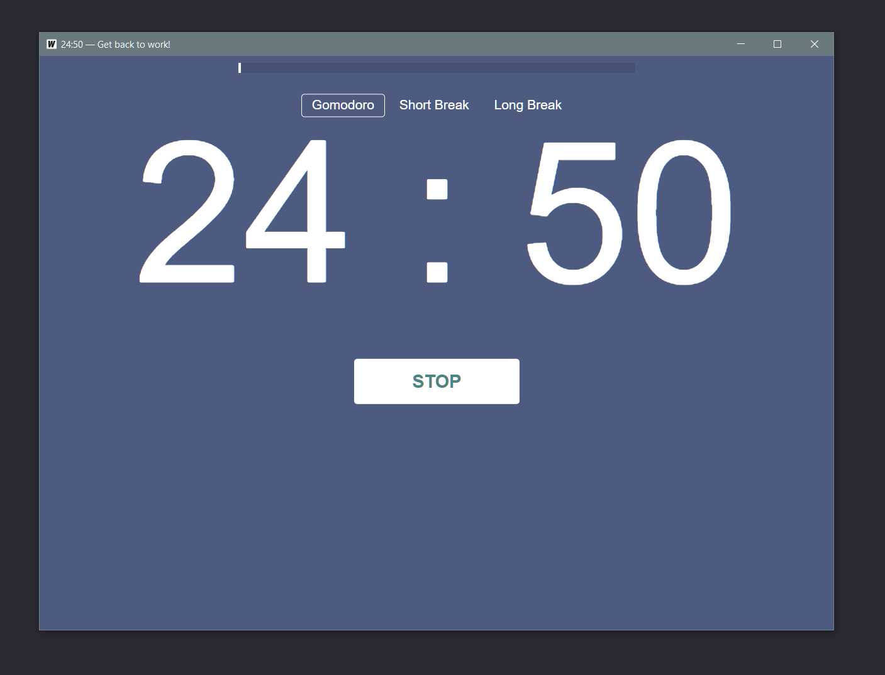

# A simple GUI Pomodoro application build with Wails + JS

## Features

- Pomodoro session (25min), short break(5min) and long break(15min)
- Sound effects
- Progress bar
- Title shows the progress

## Live Development

To run in live development mode, run `wails dev` in the project directory. This will run a Vite development
server that will provide very fast hot reload of your frontend changes. If you want to develop in a browser
and have access to your Go methods, there is also a dev server that runs on http://localhost:34115. Connect
to this in your browser, and you can call your Go code from devtools.

## Building

To build your own application use `wails build`. Your build file will appear at build/bin/gomodoro.exe
